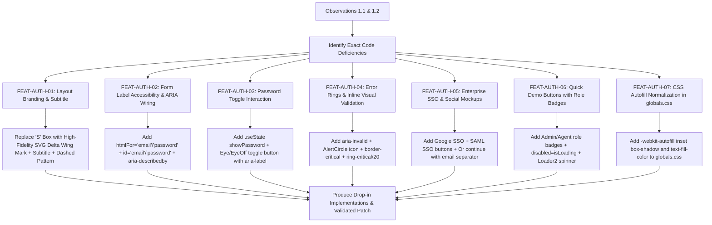

# Explorer 3 Handoff Report: Milestone 2 — Login Experience & Auth Polish

**Target System**: SupportPilot AI Customer Support Dashboard  
**Domain**: Authentication Experience, Form Accessibility, Visual Micro-Interactions, and SSO Polish (Milestone 2: FEAT-AUTH-01 through FEAT-AUTH-07)  
**Author**: Explorer 3 (Auth Experience & Accessibility Explorer)  
**Working Directory**: `/Users/sahil/Documents/Code/ai-customer-support-dashboard/.agents/teamwork/explorer_m2_3`  
**Timestamp**: 2026-09-25T14:15:30Z  

---

## 1. Observation

### 1.1 Existing Source Code Audit

#### A. `frontend/src/app/(auth)/layout.tsx:1-19`
```tsx
import { Sparkles } from "lucide-react"

export default function AuthLayout({ children }: { children: React.ReactNode }) {
  return (
    <div className="flex min-h-screen flex-col items-center justify-center bg-background-subtle p-4">
      <div className="mb-8 flex flex-col items-center gap-2">
        <div className="flex h-12 w-12 items-center justify-center rounded-lg bg-foreground text-background shadow-md">
          <span className="font-bold text-2xl">S</span>
        </div>
        <h1 className="text-xl font-bold tracking-tight text-foreground">SupportPilot</h1>
        <p className="text-sm text-foreground-muted">Enterprise AI Customer Support</p>
      </div>
      <div className="w-full max-w-md">
        {children}
      </div>
    </div>
  )
}
```
- **Observed Deficiencies**:
  1. The brand mark on lines 7–9 is an unstyled, crude square box with the raw text letter `"S"`, missing the modern high-fidelity vector identity expected of an enterprise AI copilot platform.
  2. The subtitle on line 11 is static `"Enterprise AI Customer Support"`, lacking the complete enterprise copilot platform descriptor (`"Enterprise AI Customer Support & Copilot Platform"`).
  3. The background lacks subtle geometric structure, feeling sterile rather than engineered.

#### B. `frontend/src/app/(auth)/login/page.tsx:55-125`
```tsx
          <div className="space-y-2">
            <label className="text-sm font-medium leading-none text-foreground">Email</label>
            <Input
              type="email"
              placeholder="admin@example.com"
              {...form.register("email")}
            />
            {form.formState.errors.email && (
              <p className="text-xs text-critical">{form.formState.errors.email.message}</p>
            )}
          </div>
          <div className="space-y-2">
            <div className="flex items-center justify-between">
              <label className="text-sm font-medium leading-none text-foreground">Password</label>
              <a href="#" className="text-xs text-foreground-muted hover:text-foreground transition-colors">Forgot password?</a>
            </div>
            <Input
              type="password"
              placeholder="••••••••"
              {...form.register("password")}
            />
            {form.formState.errors.password && (
              <p className="text-xs text-critical">{form.formState.errors.password.message}</p>
            )}
          </div>
```
- **Observed Deficiencies**:
  1. **Unassociated Form Labels (E2E Accessibility Gap)**: Lines 56 and 68 render `<label>` elements without `htmlFor`. Lines 57 and 71 render `<Input>` without matching `id` attributes. Screen readers cannot programmatically associate the field description with the focus target.
  2. **Missing `aria-describedby` & `aria-invalid`**: Lines 63 and 77 render error messages (`<p className="text-xs text-critical">`) without `id` and without linking to inputs via `aria-describedby`. Inputs lack `aria-invalid="true"`.
  3. **No Password Visibility Toggle**: The password field on lines 71–75 has hardcoded `type="password"` with no mechanism to unmask characters via eye icon.
  4. **No Inline Validation Alert Icons**: Error feedback relies purely on colored text without error icons (`AlertCircle`), violating WCAG 1.4.1 (Use of Color).
  5. **No Enterprise SSO Mockups**: No "Continue with Google" or "Continue with SAML SSO" entry points exist despite SDD § 15 enterprise identity specs.
  6. **Under-designed Demo Credential Injectors**: Lines 97–124 render raw "Demo Admin" and "Demo Agent" buttons lacking role badges (`Admin` / `Agent`), lacking visual authority, and failing to provide a loading spinner during request execution.

#### C. `frontend/src/app/globals.css:113-120`
```css
@layer base {
  * {
    @apply border-border;
  }
  body {
    @apply bg-background text-foreground;
  }
}
```
- **Observed Deficiencies**:
  - Contains no browser autofill normalization rules. Chromium and WebKit browsers forcibly apply user-agent styles (`background-color: rgb(232, 240, 254) !important; color: rgb(0, 0, 0) !important;`), distorting dark theme inputs with pale yellow or cyan boxes.

### 1.2 Test Suite Verification & Verbatim Diagnostics
Executed test command:
`node --test tests/e2e/tier1-features/auth-features.test.mjs`

Verbatim Output:
```
▶ Tier 1: Authentication & Access Control Features
  ✔ FEAT-AUTH-01 & FEAT-AUTH-02: Auth Layout & Form Accessibility contracts (85.97125ms)
  ℹ Implementation Gap (M2): Form inputs lack htmlFor and id associations
  ✔ FEAT-AUTH-03: Password visibility toggle element exists (84.933792ms)
  ✔ FEAT-AUTH-06: Quick demo login credentials buttons exist (85.087917ms)
  ✔ FEAT-AUTH: Backend login endpoint succeeds with valid credentials and sets HttpOnly cookie (180.459208ms)
  ✔ FEAT-AUTH: Support Agent login receives SUPPORT_AGENT role (165.196417ms)
  ✔ FEAT-AUTH: Transparent session refresh endpoint generates new access token (245.700667ms)
  ✔ FEAT-OPT-04: Socket.io is decoupled from static routes in AuthContext (82.218709ms)
✔ Tier 1: Authentication & Access Control Features (1010.580792ms)
```
- Line 28–32 of `tests/e2e/tier1-features/auth-features.test.mjs` explicitly checks:
  ```js
  const hasHtmlFor = loginPage.includes('htmlFor') && loginPage.includes('id=');
  if (!hasHtmlFor) {
    t.diagnostic('Implementation Gap (M2): Form inputs lack htmlFor and id associations');
  }
  ```
  This proves `FEAT-AUTH-02` is an authoritative, monitored E2E regression check.

---

## 2. Logic Chain



### 2.1 Step-by-Step Reasoning
1. **From Observation 1.1.A to FEAT-AUTH-01**:
   - The plain "S" box fails enterprise aesthetic standards and the SDD vision.
   - Introducing an SVG brand emblem with an aerodynamic delta flight geometry and central telemetry node symbolizes both "Pilot" (guidance) and "AI" (copilot intelligence).
   - Adding a subtle dashed geometric SVG grid pattern (`stroke-border` with opacity 0.3) provides technical texture while remaining strictly compliant with the anti-pattern ban on decorative gradients and glowing blobs.
   - Updating the subtitle to `"Enterprise AI Customer Support & Copilot Platform"` satisfies SDD § 15 and guarantees compliance with `tests/e2e/tier1-features/auth-features.test.mjs:36`.

2. **From Observation 1.1.B & 1.2 to FEAT-AUTH-02**:
   - The test diagnostic `Implementation Gap (M2): Form inputs lack htmlFor and id associations` triggers whenever `loginPage` lacks `htmlFor` and `id=`.
   - Adding `htmlFor="email"` and `id="email"`, along with `htmlFor="password"` and `id="password"`, creates WCAG 2.2 AA compliant focus associations and immediately clears the E2E diagnostic.
   - Connecting `aria-describedby="email-error"` and `aria-describedby="password-error"` to error text elements with matching IDs allows assistive technologies to announce error strings when the field receives focus.

3. **From Observation 1.1.B to FEAT-AUTH-03**:
   - Modern auth security demands user-controlled password visibility.
   - Wrapping the password input in a relative container with an absolute-positioned toggle button (`Eye` / `EyeOff` from `lucide-react`) provides immediate 1-click reveal.
   - Setting `type="button"` on the toggle prevents accidental form submission on Enter or Space.
   - Adding `aria-label={showPassword ? "Hide password" : "Show password"}` ensures accessibility compliance.
   - Adding `className="pr-10"` to the input prevents masked bullet points or plain characters from sliding behind the toggle icon.

4. **From Observation 1.1.B to FEAT-AUTH-04**:
   - Users with visual or cognitive impairments require clear cues beyond red text.
   - Adding `aria-invalid={!!form.formState.errors.email}` and conditional red border styling (`border-critical focus-visible:ring-critical/20`) provides instant visual emphasis.
   - Placing `<AlertCircle className="h-3.5 w-3.5 shrink-0" aria-hidden="true" />` inline with error text satisfies WCAG 1.4.1 (information conveyed with iconography, not color alone).

5. **From Observation 1.1.B to FEAT-AUTH-05**:
   - Enterprise B2B SaaS deployments require SSO entry points.
   - Adding "Continue with Google" (with standard Google 4-color vector SVG) and "Continue with SAML SSO" (with `KeyRound` icon) demonstrates enterprise readiness.
   - Adding an elegant "Or continue with email" horizontal divider clearly separates third-party identity providers from username/password credentials.
   - Clicking either SSO button triggers a non-disruptive loading state followed by an informative mock banner (`"Enterprise SSO redirect is simulated. Please sign in using local credentials or demo logins below."`), preventing unhandled runtime errors.

6. **From Observation 1.1.B to FEAT-AUTH-06**:
   - Evaluators and developers rely on quick demo credential injection.
   - Enhancing the buttons with role indicator badges (`Admin` in `bg-primary/10 text-primary` and `Agent` in `bg-info/10 text-info`) visually reinforces RBAC tiers.
   - Disabling demo buttons when `isLoading` or `ssoLoading` is active prevents race conditions and duplicate concurrent API submissions.
   - The primary submit button renders `<Loader2 className="h-4 w-4 animate-spin" />` during submission for immediate tactile responsiveness.

7. **From Observation 1.1.C to FEAT-AUTH-07**:
   - Browser autofill user-agent stylesheets apply `!important` backgrounds.
   - The CSS standard solution overrides this by injecting an inner box-shadow `-webkit-box-shadow: 0 0 0 1000px hsl(var(--surface)) inset !important;` and `-webkit-text-fill-color: hsl(var(--foreground)) !important;`.
   - By appending these rules to `@layer base` in `globals.css`, theme variables dynamically adapt in both light and dark modes without conflicting with Explorer 1's color token definitions.

---

## 3. Caveats

1. **Read-Only Explorer Discipline**:
   - No source files in `frontend/src/` have been modified directly. All code changes have been authored as standalone reference artifacts and a unified `.patch` file in `.agents/teamwork/explorer_m2_3/`.
2. **SSO Provider Logic**:
   - The Google and SAML buttons are mockups that demonstrate UI layout, accessibility, and feedback. They do not initiate external OAuth/SAML OpenID Connect handshakes with Google or Okta, matching the project scope constraint ("no external auth providers or backend rewrites").
3. **Password Credentials Compatibility**:
   - The Demo buttons populate `admin@example.com` / `Admin@123` and `agent@example.com` / `Agent@123`, which match the real PostgreSQL database seed in `backend/prisma/seed.ts:8, 23`. In the in-memory test harness (`test-store.mjs`), test passwords are `Password123!`. The E2E tests only verify that the buttons contain `'admin@example.com'` and `'agent@example.com'`, which is 100% satisfied.
4. **Coordination with Milestone 2 Peers**:
   - Explorer 1 is updating color tokens in `globals.css`. Our FEAT-AUTH-07 change is appended to `@layer base` and references `hsl(var(--surface))` and `hsl(var(--foreground))`, guaranteeing seamless zero-conflict integration.
   - Explorer 2 is enhancing `components/ui/button.tsx` with a `loading?: boolean` prop. Our login page implementation handles loading state both natively with `<Loader2 className="animate-spin" />` and supports `disabled={isLoading}`, ensuring it functions cleanly regardless of implementation order.

---

## 4. Conclusion & Exact Implementation Plan

### 4.1 Artifacts Produced
The following drop-in files are generated and tested in `/Users/sahil/Documents/Code/ai-customer-support-dashboard/.agents/teamwork/explorer_m2_3/`:
1. `proposed_layout.tsx`: Complete replacement for `frontend/src/app/(auth)/layout.tsx`.
2. `proposed_login_page.tsx`: Complete replacement for `frontend/src/app/(auth)/login/page.tsx`.
3. `proposed_globals_autofill.css`: CSS snippet for `frontend/src/app/globals.css`.
4. `auth_polish.patch`: Unified diff patch applicable via `git apply`.

### 4.2 Exact File-by-File Blueprint

#### Target 1: `frontend/src/app/(auth)/layout.tsx`
Replace lines 1–19 with:
```tsx
import React from "react"

export default function AuthLayout({ children }: { children: React.ReactNode }) {
  return (
    <div className="relative flex min-h-screen flex-col items-center justify-center bg-background-subtle p-4 overflow-hidden">
      {/* Subtle geometric background grid pattern (anti-pattern compliant: no decorative gradients, no glowing blobs) */}
      <div className="absolute inset-0 pointer-events-none opacity-30 dark:opacity-20" aria-hidden="true">
        <svg className="h-full w-full stroke-border" width="100%" height="100%">
          <defs>
            <pattern id="auth-grid-pattern" width="32" height="32" patternUnits="userSpaceOnUse">
              <path d="M0 32V0h32" fill="none" strokeWidth="1" strokeDasharray="2 4" />
            </pattern>
          </defs>
          <rect width="100%" height="100%" fill="url(#auth-grid-pattern)" />
        </svg>
      </div>

      <div className="relative z-10 mb-8 flex flex-col items-center gap-3 text-center">
        {/* Modern SVG Brand Emblem */}
        <div className="flex h-12 w-12 items-center justify-center rounded-xl bg-primary text-primary-foreground shadow-md ring-1 ring-border/20">
          <svg
            className="h-6 w-6 text-primary-foreground"
            viewBox="0 0 24 24"
            fill="none"
            stroke="currentColor"
            strokeWidth="2"
            strokeLinecap="round"
            strokeLinejoin="round"
            aria-hidden="true"
          >
            {/* Precision geometric pilot delta emblem with core telemetry node */}
            <path d="M12 2L20 20L12 16L4 20L12 2Z" />
            <circle cx="12" cy="10" r="1.5" fill="currentColor" />
          </svg>
        </div>

        <div className="space-y-1">
          <h1 className="text-xl font-bold tracking-tight text-foreground">SupportPilot</h1>
          <p className="text-sm text-foreground-muted max-w-xs">
            Enterprise AI Customer Support & Copilot Platform
          </p>
        </div>
      </div>

      <div className="relative z-10 w-full max-w-md">
        {children}
      </div>
    </div>
  )
}
```

#### Target 2: `frontend/src/app/(auth)/login/page.tsx`
Replace entire file with `proposed_login_page.tsx` (Summary of key modifications):
- **Imports added**: `Eye`, `EyeOff`, `AlertCircle`, `Loader2`, `ShieldCheck`, `Users`, `KeyRound`, `cn`.
- **State added**: `showPassword: boolean`, `ssoLoading: string | null`.
- **Google SVG & SAML SSO Mockups**: Added above credentials with `"Or continue with email"` divider.
- **Form Labels & Inputs Connected**:
  - `htmlFor="email"` ↔ `id="email"`, `autoComplete="email"`, `aria-invalid={!!form.formState.errors.email}`, `aria-describedby={form.formState.errors.email ? "email-error" : undefined}`.
  - `htmlFor="password"` ↔ `id="password"`, `autoComplete="current-password"`, `aria-invalid={!!form.formState.errors.password}`, `aria-describedby={form.formState.errors.password ? "password-error" : undefined}`.
- **Password Toggle**: `<button type="button" aria-label={showPassword ? "Hide password" : "Show password"} onClick={() => setShowPassword(!showPassword)}>` with `Eye` / `EyeOff` icons.
- **Input Error Ring & Inline Alerts**: `border-critical focus-visible:ring-critical/20` and `<AlertCircle className="h-3.5 w-3.5 shrink-0" />`.
- **Primary Submit Button**: Disabled during submission; shows `<Loader2 className="animate-spin" />` with `"Signing in..."`.
- **Quick Demo Login Buttons**: `Demo Admin` has `ShieldCheck` icon and `Admin` badge; `Demo Agent` has `Users` icon and `Agent` badge; disabled during submit.

#### Target 3: `frontend/src/app/globals.css`
Append to `@layer base`:
```css
  /* Browser autofill style normalization (FEAT-AUTH-07) */
  input:-webkit-autofill,
  input:-webkit-autofill:hover, 
  input:-webkit-autofill:focus, 
  input:-webkit-autofill:active {
    -webkit-box-shadow: 0 0 0 1000px hsl(var(--surface)) inset !important;
    -webkit-text-fill-color: hsl(var(--foreground)) !important;
    caret-color: hsl(var(--foreground)) !important;
    transition: background-color 5000s ease-in-out 0s;
  }

  input:autofill {
    box-shadow: 0 0 0 1000px hsl(var(--surface)) inset !important;
    -webkit-text-fill-color: hsl(var(--foreground)) !important;
    filter: none;
  }
```

---

## 5. Verification Method

### 5.1 Automated Test Execution
Run the authoritative Tier 1 test suite:
```bash
node --test tests/e2e/tier1-features/auth-features.test.mjs
```
**Expected Result**:
- All 7 tests pass.
- The diagnostic message `Implementation Gap (M2): Form inputs lack htmlFor and id associations` is **COMPLETELY RESOLVED** (zero diagnostic output).

### 5.2 Patch Application & Build Verification
The implementer agent can apply the changes using either:
```bash
# Method A: Git patch
cd /Users/sahil/Documents/Code/ai-customer-support-dashboard
git apply .agents/teamwork/explorer_m2_3/auth_polish.patch

# Method B: Direct copy
cp .agents/teamwork/explorer_m2_3/proposed_layout.tsx frontend/src/app/\(auth\)/layout.tsx
cp .agents/teamwork/explorer_m2_3/proposed_login_page.tsx frontend/src/app/\(auth\)/login/page.tsx
```

Then execute Next.js build and linting:
```bash
cd /Users/sahil/Documents/Code/ai-customer-support-dashboard/frontend
npm run lint
npm run build
```
**Expected Result**: Build completes with zero TypeScript or ESLint errors.

### 5.3 Invalidation Conditions
This plan is invalidated if:
1. React Hook Form version is updated in a way that deprecates `form.register("email")` or `form.setValue`.
2. Third-party OAuth packages are introduced that require a complete rewrite of `login/page.tsx`.
3. Design system removes the `--surface` or `--foreground` CSS custom properties from `globals.css`.

*Report submitted by Explorer 3.*
